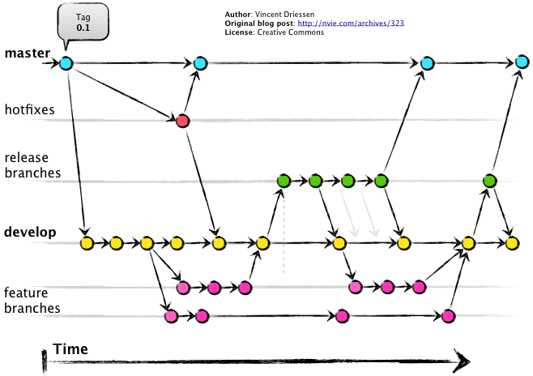
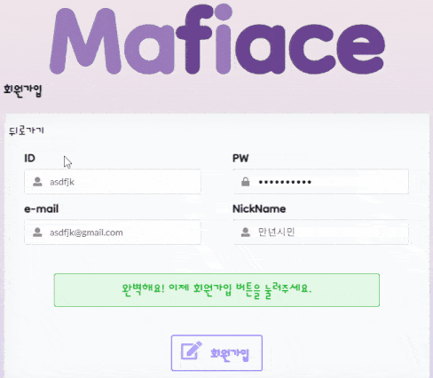
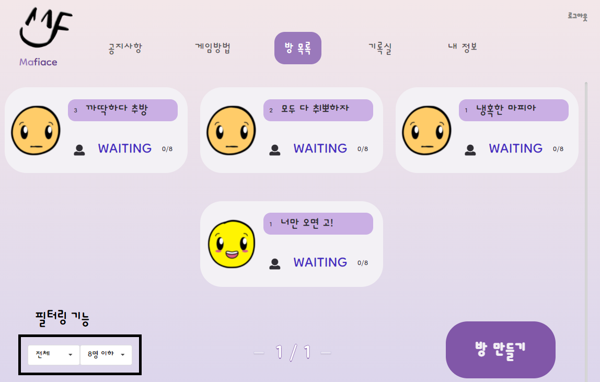
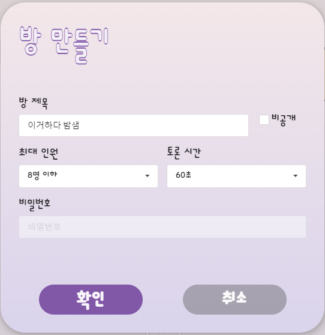
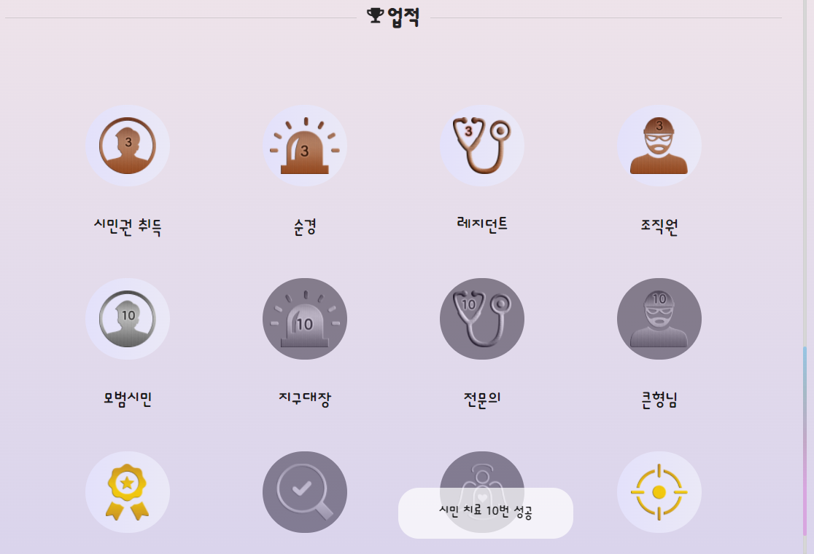
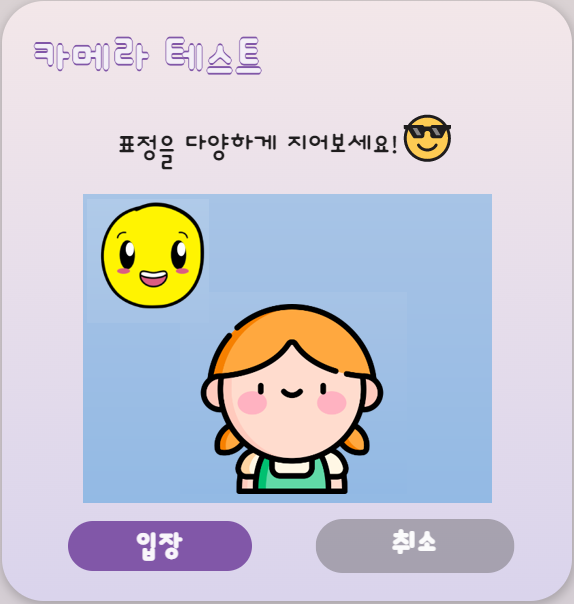
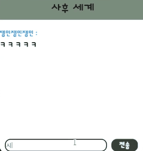
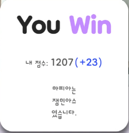

# Mafiace


[TOC]

---


## 👤 프로젝트 개요

>  [**Mafiace**](https://i6a602.p.ssafy.io/)는 다양한 직업과 얼굴 감정 인식 API를 활용한 **온라인 마피아 게임 서비스**입니다.
>
>  누구나 쉽게 즐길 수 있는 신감각 시스루 게임 Mafiace!! 지금 바로 만나보세요.


### 프로젝트 목표

- 원활한 온라인 마피아 게임 서비스 구현
- 사회자가 없어도 모두가 즐길 수 있도록 게임을 자동화
- 비대면 환경에서 팀원, 친구, 동료들과 아이스브레이킹을 통해 유대감과 친목을 형성할 수 있는 기회 마련
- 표정 점수라는 차별점을 내세워 색다른 게임 경험 제공


### 주 사용자 대상

- COVID-19로 인해 자주 만나지 못하는 20대
- 여러 명이 함께 하는 온라인 게임을 즐기는 MZ 세대


## 💻 개발 환경

### 일정

- 2022.01.10 ~ 2022.01.16: 아이디어 구상, 기획, 필요 기술 스택 학습
- 2022.01.17 ~ 2022.01.30: 세부 기획, 유저/공지사항/방 관련 로직, Frontend 기본 틀
- 2022.01.31 ~ 2022.02.18: 게임 기능, Frontend 개선, 테스트/디버깅/최적화, 서비스 UCC 제작


### 개발 팀: SIXMAN

- **김동현**: 팀장, Frontend 담당, 서비스 디자인 전반, CSS 및 React
- **연진우**: Frontend 담당, 서비스 디자인 전반, Face API 관련 기능
- **공윤환**: Backend 담당, Frontend 보조, 서버 관리, OpenVidu, Docker 
- **김종우**: Backend 담당, 회원 탈퇴, 업적 기능, 서비스용 그래픽 제작
- **조영운**: Backend 담당, 회원 기능, 게임 로직 전반, WebSocket 관련 기능
- **천재원**: Backend 담당, 게임 로직 전반, JPA 및 QueryDSL, 게임 기록 및 전적, 영상 제작


### 기술 스택

- Frontend: JavaScript, React, OpenVidu 2.20.0, Face API 0.22.2
- Backend: Spring Boot, JPA, Hibernate, QueryDSL, MySQL, Docker
- 협업: Git, GitLab, Sourcetree, Jira, Mattermost


## 📖 컨벤션

### Git

- 커밋 메세지: `[Jira 이슈 번호] prefix: commit message`
  - 커밋 메시지는 한글로 작성
  - 간결하게 명사형으로 (ex. 로그인 기능 추가, 폰트 OO으로 변경, 입장 버튼 삭제 등)
  - 작업 단위별로 커밋 
- Type prefix: 커밋의 분류를 나타내기 위해 영어로 작성
  - `feat`: 새 기능 추가
  - `fix`: 버그 수정
  - `docs`: 문서 작업
  - `style`: 포매팅, 들여쓰기 등 스타일 변경
  - `refactor`: 코드 리팩토링
  - `perf`: 성능 개선
  - `test`: 테스트 코드 관련
  - `build`: 빌드 관련 파일 수정
  - `ci`: CI 설정 파일 수정
  - `chore`: 기타 수정 사항
  - `revert`: commit revert 관련

>  참고: [https://velog.io/@outstandingboy/Git-커밋-메시지-규약-정리-the-AngularJS-commit-conventions#-changelogmd-생성](https://velog.io/@outstandingboy/Git-커밋-메시지-규약-정리-the-AngularJS-commit-conventions#-changelogmd-생성)

- Branch

  

- `master`, `develop`, `feature` 브랜치 활용
- 작업 단위별로 `feature` 브랜치에서 작업
- merge request는 팀원의 검토 후 merge

> `develop` 브랜치로 이동 -> `feature` 브랜치 생성 및 이동 -> 소스 코드 작성 -> 변경 사항 commit -> 브랜치 origin에 push -> 작업 완료 후 merge request


### Develop

- Java: Google Java Style Guide 적용

  > 참고: https://velog.io/@injoon2019/IntelliJ%EC%97%90-Google-Java-Style-Guide-%EC%A0%81%EC%9A%A9%ED%95%98%EA%B8%B0

- Backend (Spring)

  - 파일명: PascalCase
  - 패키지명: lowercase
  - 클래스: PascalCase
  - 메소드: camelCase
  - 변수: camelCase
  - 상수: SNAKE_CASE
  - DB: snake_case

- Frontend (React)

  ```json
  settings.json
  	{
  		"[javascriptreact]": {
  		"editor.defaultFormatter": "esbenp.prettier-vscode"
  		},
  		"editor.formatOnSave": true,
  		"workbench.editorAssociations": {
  		"*.ipynb": "jupyter.notebook.ipynb"
  		},
  		"editor.fontSize": 16,
  		"git.autofetch": true,
  		"[javascript]": {
  		"editor.defaultFormatter": "esbenp.prettier-vscode"
  		},
  		"[vue]": {
  		"editor.defaultFormatter": "esbenp.prettier-vscode"
  		}
  	}
  ```

  - 변수: camelCase
  - 함수: camelCase
  - 상수: SNAKE_CASE
  - React 파일명: PascalCase
  - JS 파일명: kebab-case

- DB

  - 테이블, 뷰, 컬럼 등 모든 식별자는 소문자
  - 여러 단어가 합쳐저 만들어진 복합어구는 snake_case 사용
  - Object 이름은 되도록 약어가 아닌 전체 이름을 사용


## 🏢 설계

### ERD


### API

- 로그인 `/api/auth`
  - 로그인: POST `/login`
- 게임 방 관리 `/api/game`
  - 게임 방 목록 조회: GET
  - 방 비밀번호 확인: GET `/checkpw`
- 공지사항 `/api/notice`
  - 작성: POST
  - 전체 조회: GET
  - 특정 공지사항 조회: GET `/{postNum}`
  - 수정: PATCH `/{postNum}`
  - 삭제: DELETE `/{postNum}`
- 세션 관리 `/api/session`
  - 세션방 생성: POST `/token`
  - 토큰 얻기: GET `/token`
  - 세션방 삭제: DELETE
  - 세션방 나가기: DELETE `/user`
  - 게임방 Ready: GET `/Ready`
- 유저 관련 `/api/user`
  - 회원 가입: POST
  - 회원정보 수정: PATCH
  - 비밀번호, 닉네임 변경: PATCH `/update/password`, `/update/nickname`
  - 계정 및 전적 정보: POST `/userinfo`, `/userRecord`
  - 레이팅: GET `/rating`
  - 아이디, 이메일, 닉네임 중복 확인: GET `/idcheck`, `/emailcheck`, `/nicknamecheck`
  - 아이디 및 비밀번호 찾기: GET `/id`, `/password`
  - 회원 탈퇴 및 탈퇴 취소: POST `/deleteaccount`, `/restoreaccount`


## 🎮 서비스 기능

### 1. 회원 가입 및 로그인




Mafiace에 회원 가입을 하시면 온라인 마피아 게임은 물론 전적과 업적, 티어 등의 기능을 즐기실 수 있습니다.

ID와 비밀번호, 이메일 주소, 닉네임을 입력해 간편하게 가입할 수 있으며, ID 혹은 비밀번호를 잊으셨어도 가입하셨을 때의 이메일 주소로 찾을 수 있습니다.


### 2. 메인 화면 (메뉴바)

#### 2-1. 공지사항

Mafiace 운영진의 공지사항을 확인할 수 있습니다. 서버 점검, 버그 수정, 게임 패치, 이벤트 관련 글을 게시할 예정입니다.


#### 2-2. 게임 방법

Mafiace의 게임 방법을 확인할 수 있습니다. 플레이 전에 꼭 확인해주세요!


#### 2-3. 방 목록




현재 개설중인 방을 확인할 수 있습니다. 게임에 쉽게 참여할 수 있도록 대기중인 방이 앞에 표시됩니다. 또한 방의 공개/비공개 여부 및 최대 참여 인원에 따라 방을 필터링할 수도 있습니다.





방을 개설할 때에는 제목, 방의 공개/비공개 여부, 최대 참여 인원, 낮의 토론 시간을 설정할 수 있습니다. 


#### 2-4. 기록실



전적 (승/패), 최근 10게임의 기록, 업적을 확인할 수 있습니다. 업적은 난이도 및 특수성에 따라 동색, 은색, 금색으로 나뉘어져 있고, 업적 아이콘 위에 커서를 올리면 업적 획득 조건을 볼 수 있습니다. 업적 클리어에 도전해 보세요!


#### 2-5. 내 정보

회원 정보를 확인하고 수정할 수 있어요. 또한 본인의 티어와 레이팅도 확인할 수 있습니다. Mafiace는 현재 Bronze4 부터 Rainbow1까지 20개의 티어가 있습니다. 실력을 갈고 닦아 티어를 UP!


### 3. 게임

#### 3-1. 방 입장




방을 만들거나 입장하기 전에 카메라 테스트가 진행됩니다. Face API와 가중치를 통해 가장 점수가 높게 나온 감정에 해당하는 아이콘이 좌측 상단에 표시됩니다. 또한 재미있는 게임 환경을 위해 얼굴 인식이 되지 않는 경우 방에 입장할 수 없도록 설정되어 있습니다.


#### 3-2. 게임 시작

방에 최소 4인이 있을 경우 방장은 화면 우측 상단의 Start 버튼을 눌러 게임을 시작할 수 있습니다. 게임이 시작되면 카운트다운 후 자신에게 배정된 직업이 카드 형식의 창으로 표시됩니다. **카드를 놓치셨거나 게임 도중에 자신의 직업을 잊으셨어도 게임 중 화면 우측 상단의 "내 직업" 버튼을 클릭하면 자신의 직업을 다시 확인할 수 있습니다.**


#### 3-3. 낮


낮에는 영상 채팅으로 방의 토론 시간만큼 대화를 나눌 수 있습니다. 사망한 플레이어 외의 감정은 Face API로 1.5초 간격으로 인식되며, 각 화면 우측 상단의 이모티콘으로 표시됩니다. 이모티콘에 커서를 올리면 각 감정별 점수를 그래프로도 확인할 수 있습니다.

 살아 있는 다른 플레이어의 카메라 화면 하단에는 투표 버튼이 있으며, 이를 통해 추방할 플레이어를 선택할 수 있습니다. 토론 시간이 종료되거나 **살아 있는 모든 플레이어가 투표를 완료하면** 표가 집계되고, 가장 많은 표를 받은 플레이어는 추방됩니다. 동률이거나 아무도 투표를 하지 않았을 때는 아무도 추방당하지 않습니다. **또한, 게임 밸런스를 위하여 첫 날 낮에는 투표할 수 없도록 설정되어 있습니다.**


#### 3-4. 밤


밤은 토론 시간과 관계 없이 15초간 진행되며, 자신의 직업에 따라 화면이 조금씩 다르게 표시됩니다.

- **일반 시민**은 본인의 화면만 보이며, 나머지 플레이어들은 검은 화면으로 보입니다. 나머지 플레이어의 마이크 소리도 들을 수 없습니다.
- **마피아**는 다른 마피아의 화면을 볼 수 있으며, 시민들의 목소리도 들을 수 있습니다. 마피아와 시민을 쉽게 구분할 수 있도록 시민은 흐림 처리된 화면으로 보이며, 물론 다른 시민들은 마피아의 대화를 들을 수 없습니다.
- **경찰**과 **의사**는 일반 시민과 동일한 화면 구조이나, 각각 "치료"와 "수사"버튼이 다른 플레이어의 화면 하단에 표시됩니다. 버튼을 클릭하여 밤마다 특수 능력을 1회 사용할 수 있습니다. 


#### 3-5. 사후 세계




죽은 플레이어들도 추리를 하며 지루하지 않게 게임을 즐길 수 있도록 채팅 기능을 구현하였습니다. 사망 후 화면 우측 하단에 표시되는 "사후 세계" 버튼을 클릭하여 채팅창을 띄울 수 있습니다.


#### 3-6. 게임 종료




시민 또는 마피아 팀의 승리가 확정되면 게임이 종료되며, 결과 창이 화면 중앙에 표시됩니다. 승패 여부 및 자신의 직업에 따라 레이팅이 가감됩니다. 게임 종료 후에는 같은 방의 대기 상태로 전환됩니다.


## 💡 프로젝트 Wiki

- [JPA를 사용하여 DB 구축하기](https://lab.ssafy.com/s06-webmobile1-sub2/S06P12A602/-/wikis/JPA%EB%A5%BC-%EC%82%AC%EC%9A%A9%ED%95%98%EC%97%AC-DB%EA%B5%AC%EC%84%B1%ED%95%98%EA%B8%B0)
- [OpenVidu 미디어 서버 구축](https://lab.ssafy.com/s06-webmobile1-sub2/S06P12A602/-/wikis/openVidu-%EB%AF%B8%EB%94%94%EC%96%B4-%EC%84%9C%EB%B2%84-%EA%B5%AC%EC%B6%95)
- [WebSocket을 이용한 채팅](https://lab.ssafy.com/s06-webmobile1-sub2/S06P12A602/-/wikis/websocket%EC%9D%84-%EC%9D%B4%EC%9A%A9%ED%95%9C-%EC%B1%84%ED%8C%85)


## 🎁 프로젝트 산출물

- [중간 발표 자료](https://docs.google.com/presentation/d/1MGD5Phwqq-WI5f14q6P44MnWq7EZLTsd/edit#slide=id.g10be5616b1f_0_147)
- 최종 발표 자료
- 포팅 매뉴얼 및 시연 시나리오
