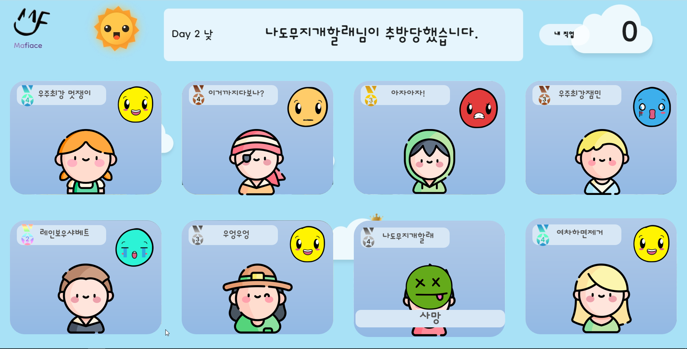
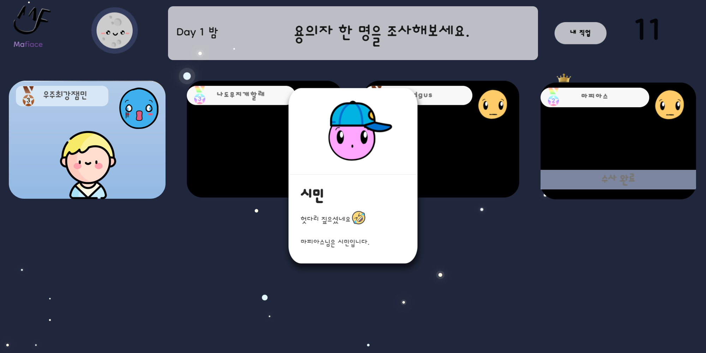
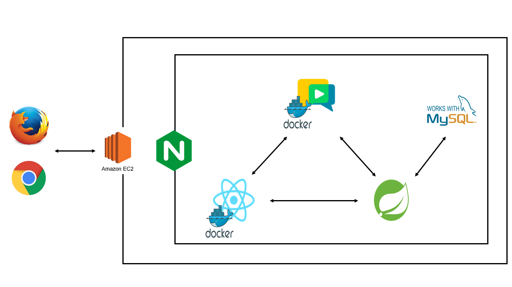

# Mafiace


<br>

[[_TOC_]]

<br>

---

## 👤 프로젝트 개요





>  [**Mafiace**](https://i6a602.p.ssafy.io/)는 다양한 직업과 얼굴 감정 인식 API를 활용한 **온라인 마피아 게임 서비스**입니다.
>
>  누구나 쉽게 즐길 수 있는 신감각 시스루 게임 Mafiace!! 지금 바로 만나보세요.


### 프로젝트 목표

- 원활한 온라인 마피아 게임 서비스 구현
- 사회자가 없어도 모두가 즐길 수 있도록 게임을 자동화
- 비대면 환경에서 팀원, 친구, 동료들과 아이스브레이킹을 통해 유대감과 친목을 형성할 수 있는 기회 마련
- 표정 점수라는 차별점을 내세워 색다른 게임 경험 제공


### 주 사용자 대상

- COVID-19로 인해 자주 만나지 못하는 20대
- 여러 명이 함께 하는 온라인 게임을 즐기는 MZ 세대

<br>

## 💻 개발 환경

### 일정

- 2022.01.10 ~ 2022.01.16: 아이디어 구상, 기획, 필요 기술 스택 학습
- 2022.01.17 ~ 2022.01.30: 세부 기획, 유저/공지사항/방 관련 로직, Frontend 기본 틀
- 2022.01.31 ~ 2022.02.18: 게임 기능, Frontend 개선, 테스트/디버깅/최적화, 서비스 UCC 제작


### 개발 팀: SIXMAN

- **김동현**: 팀장, Frontend 담당, 서비스 디자인 전반, CSS 및 React
- **연진우**: Frontend 담당, 서비스 디자인 전반, Face API 관련 기능
- **공윤환**: Backend 담당, Frontend 보조, 서버 관리, OpenVidu, Docker 
- **김종우**: Backend 담당, 회원 탈퇴, 업적 기능, 서비스용 그래픽 제작
- **조영운**: Backend 담당, 회원 기능, 게임 로직 전반, WebSocket 관련 기능
- **천재원**: Backend 담당, 게임 로직 전반, JPA 및 QueryDSL, 게임 기록 및 전적, 영상 제작


### 기술 스택



- IDE
  - IntelliJ IDEA Community Edition 2021.3.1
  - Visual Studio Code 1.64.2
- Frontend
  - HTML5, CSS, JavaScript (ES6)
  - React 17.0.2
  - face-api-js 0.22.2
  - semantic-ui-react 2.1.0
  - slick-carousel 1.8.1
  - sockjs-client 1.5.2
  - recharts 2.1.9
- Backend
  - Java OpenJDK 1.8.0 
  - Spring Boot 2.4.5
  - Spring Data JPA
  - Hibernate 5.4.30
  - OpenVidu 2.20.0
  - QueryDSL 4.4.0
  - Lombok
  - Spring Security
- DB
  - MySQL 8.0.28-0ubuntu0.20.04.3
- Server
  - AWS EC2 (Ubuntu 20.04 LTS)
- 형상관리
  - GitLab
- 이슈 관리
  - Jira
- Tools
  - Mattermost 4.7.0
  - Sourcetree 3.4.7

<br>

## 🏢 프로젝트 파일 구조

>  Frontend

```
mafiace-frontend
├── build
├── node_modules
├── public
└── src
	├── components
	│   ├── common
	│   ├── ingame
	│   └── main
	|		├── header
	|		├── login
	|		├── mypage
	|		├── notice
	|		├── record
	|		├── room
	|		└── rules
	|
	├── pages
	│   ├── ingame
	│   └── main
	│
	└── config
```


> Backend

```
com
└── mafiace
	├── api
	|	├── controller
	|	├── request
	|	├── response
	|	└── service
	|
	├── common
	|	├── auth
	|	└── model
	|
	├── config
	├── db
	|	├── entity
	|	└── repository
	|
	└── game
		└── honor
```

<br>

## 💡 프로젝트 Wiki

- [프로젝트 ERD](https://lab.ssafy.com/s06-webmobile1-sub2/S06P12A602/-/wikis/ERD)
- [프로젝트 API](https://lab.ssafy.com/s06-webmobile1-sub2/S06P12A602/-/wikis/API)
- [서비스 기능](https://lab.ssafy.com/s06-webmobile1-sub2/S06P12A602/-/wikis/%EC%84%9C%EB%B9%84%EC%8A%A4-%EA%B8%B0%EB%8A%A5)
- [Git 및 개발 컨벤션](https://lab.ssafy.com/s06-webmobile1-sub2/S06P12A602/-/wikis/Git-%EB%B0%8F-%EA%B0%9C%EB%B0%9C-%EC%BB%A8%EB%B2%A4%EC%85%98)
- [JPA를 사용하여 DB 구축하기](https://lab.ssafy.com/s06-webmobile1-sub2/S06P12A602/-/wikis/JPA%EB%A5%BC-%EC%82%AC%EC%9A%A9%ED%95%98%EC%97%AC-DB%EA%B5%AC%EC%84%B1%ED%95%98%EA%B8%B0)
- [OpenVidu 미디어 서버 구축](https://lab.ssafy.com/s06-webmobile1-sub2/S06P12A602/-/wikis/openVidu-%EB%AF%B8%EB%94%94%EC%96%B4-%EC%84%9C%EB%B2%84-%EA%B5%AC%EC%B6%95)
- [WebSocket을 이용한 채팅](https://lab.ssafy.com/s06-webmobile1-sub2/S06P12A602/-/wikis/websocket%EC%9D%84-%EC%9D%B4%EC%9A%A9%ED%95%9C-%EC%B1%84%ED%8C%85)

<br>

## 🎁 프로젝트 산출물

- [중간 발표 자료](https://docs.google.com/presentation/d/1MGD5Phwqq-WI5f14q6P44MnWq7EZLTsd/edit#slide=id.g10be5616b1f_0_147)
- [포팅 매뉴얼](https://lab.ssafy.com/s06-webmobile1-sub2/S06P12A602/-/blob/develop/exec/%EB%B0%B0%ED%8F%AC.md)
- [시연 시나리오](https://lab.ssafy.com/s06-webmobile1-sub2/S06P12A602/-/blob/master/exec/%EC%8B%9C%EC%97%B0%20%EC%8B%9C%EB%82%98%EB%A6%AC%EC%98%A4.pptx)

